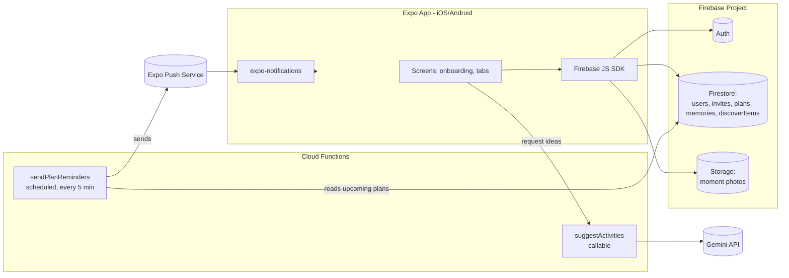

## Goal Capsule

- **Objective:** People using "With." can create an account, connect with a friend, plan and get reminded about shared activities, and build a persisted photo/note story together — all from a real Android or iPhone app backed by a live server, not a click-through prototype.
- **Means:** Rebuild the existing React web prototype (`src/`) as a React Native (Expo) app for iOS + Android, backed by Firebase (Auth, Firestore, Storage, Cloud Messaging) plus a small backend proxy for the AI activity-suggestion calls.
- **Product authority:** The existing prototype's 12-screen flow and 4-tab structure (Home, Our Story, Discover, You) is the source of truth for screens, copy, and navigation shape; this plan does not redesign the product, only makes it real and native.
- **Open blockers:** None — all scope questions below were resolved in dialogue (see Key Decisions).

## Product Contract

### Summary

Rebuild "With." — a two-person friendship/activity-planning prototype — as a cross-platform React Native (Expo) mobile app with a Firebase backend, making account creation, friend connection, activity planning with push reminders, and the shared-moments story feed all persist for real. The Discover tab and AI activity suggestions carry over with reduced but real scope.

### Key Decisions

- **Mobile framework: React Native via Expo.** Chosen over Flutter and separate native (Swift/Kotlin) codebases to reuse the existing React screen/data model and ship both platforms from one codebase. (session-settled: user-directed — chosen over Flutter and native Swift/Kotlin)
- **Backend: Firebase (Auth, Firestore, Storage, Cloud Messaging).** Chosen over a self-hosted Node/Postgres API and over Supabase, trading platform lock-in for fastest path to real auth, data, file storage, and push notifications. (session-settled: user-directed — chosen over Node/Express+PostgreSQL and Supabase) Governs R1, R4, R6, R9.
- **All four core loops are real in this build, not mocked:** account/login, friend connect, activity planning + notifications, and the shared-moments story feed. (session-settled: user-directed) Governs R1–R11.
- **AI activity-idea generation is kept**, proxied through a small backend function so the Gemini API key never ships inside the app binary. (session-settled: user-directed — chosen over dropping AI for v1) Governs R12, R13.
- **Discover tab stays static/admin-curated content for v1**, not user-generated or live/location-scraped listings. Reduces this build to the core relationship loop instead of a listings marketplace. (session-settled: user-directed — chosen over a fully dynamic Discover feature) Governs R14.

### Actors

- **A1.** A user (account holder) — creates an account, connects with one friend, proposes/accepts plans, checks in after activities, and captures shared moments.
- **A2.** A connected friend — the counterpart to A1 in every two-person flow (invites, plan negotiation, shared story).
- **A3.** The backend/Firebase project — owns auth, persisted data, file storage, and delivers push notifications.

### Requirements

**Account & authentication**
- R1. A person can create an account and log in using real Firebase Authentication (email/password at minimum), replacing the current mock "Create Account" screen.
- R2. A logged-in user's session persists across app restarts on their device.
- R3. Only an authenticated user can reach the main app (home/story/discover/you tabs) or friend/plan data.

**Friend connection**
- R4. A user can connect with a friend via a real invite mechanism (shareable invite link or in-app search/request) that links two real Firebase Auth accounts as a friend pair in Firestore.
- R5. Each user's app reflects the current state of the friend connection (invited, connected) without manual refresh needed beyond normal app usage.

**Activity planning & notifications**
- R6. A user can propose an activity, date/time, and note to their connected friend; the friend can accept, or propose a different time/activity, with the result persisted in Firestore for both accounts.
- R7. Both users see the same current plan and its status (pending, accepted, completed) from persisted data, not local-only state.
- R8. The app checks a user in after a planned activity (did it happen, how did it feel) and persists that check-in.
- R9. A real push notification (via Firebase Cloud Messaging) is delivered to both users ahead of a planned activity's scheduled time, replacing the current in-app-only simulated banner.

**Shared moments / story**
- R10. After a check-in, a user can attach a photo and/or note to the memory, with the photo uploaded to Firebase Storage rather than kept only as a local URI.
- R11. Saved moments appear, persisted, in the shared "Our Story" timeline for both connected users, newest first, matching the existing UI's grouping by month.

**AI activity suggestions**
- R12. A user can request AI-generated activity ideas from the "Choose Activity" screen; the request is proxied through a backend function rather than calling the Gemini API directly from the app.
- R13. The Gemini API key is never embedded in the mobile app bundle or exposed to the client.

**Discover tab**
- R14. The Discover tab (for-you, experiences, community, near-you sections) renders content stored in Firestore that an admin can edit directly in the Firebase console, without requiring an app release to change listings; it does not require user submissions, live scraping, or real geolocation-based "near you" results in this build.

**Mobile app shell**
- R15. All 12 existing flow screens and 4 tab screens are rebuilt as native React Native screens preserving the existing navigation shape (linear onboarding flow, then persistent bottom-tab main app), running on both iOS and Android.

### Key Flows

- **F1. Onboarding to first plan.** Trigger: new user opens the app. Welcome → create account (R1) → connect friend (R4) → choose activity (R15) → invite friend with time/note (R6) → friend accepts or counter-proposes (R6) → plan confirmed, push reminder scheduled (R9) → lands in main tabs. Covers R1, R4, R6, R9, R15.
- **F2. Activity completion to shared memory.** Trigger: push notification fires near the planned time (R9). User opens check-in (R8) → marks done with an emotional tag → optionally captures photo/note/voice (R10) → moment saved to the shared story for both users (R11). Covers R8, R9, R10, R11.
- **F3. Returning-user activity planning.** Trigger: an already-connected pair wants a new plan. From Home, start new activity → optionally request AI suggestions (R12, proxied per R13) or pick from the curated list → same invite/accept/confirm path as F1 from that point. Covers R6, R12, R13.

### Acceptance Examples

- AE1. **Given** two users have never connected, **when** user A sends an invite link and user B opens it and accepts, **then** both accounts show each other as a connected friend in Firestore and in each user's app. Covers R4, R5.
- AE2. **Given** a confirmed plan for "Saturday 6:00 PM", **when** the scheduled reminder time arrives, **then** both connected users' devices receive a push notification, even if the app is closed. Covers R9.
- AE3. **Given** a user completes check-in with a photo attached, **when** they save the moment, **then** the photo appears in Firebase Storage and the memory appears in both users' "Our Story" feed without either user needing to manually sync. Covers R10, R11.
- AE4. **Given** the Gemini-backed suggestion feature, **when** a user requests AI ideas, **then** the request goes through the backend function and no Gemini API key appears in the shipped app's code or network calls made directly by the client. Covers R12, R13.

### Scope Boundaries

**Deferred for later:**
- Live/geolocation-based "near you" Discover results.
- User-submitted or partner-submitted Discover listings.
- Group plans or more than one connected friend per user.
- In-app chat/messaging beyond the existing lightweight note-on-invite text.

**Outside this product's identity (not planned at all here):**
- Public/social-network-style discovery of strangers (this stays a private, one-friend-at-a-time app per the existing prototype's design).

### Dependencies / Assumptions

- Assumes a Firebase project will be created and billing enabled as needed for Cloud Messaging and Storage at scale.
- Assumes Expo's managed workflow is sufficient (no requirement surfaced yet for a native module Expo can't support); if one emerges during planning, it may require ejecting to a bare React Native workflow.
- The existing mock data in `src/data.ts` and the 12 component screens in `src/components/` are the reference for copy, structure, and visual design during the rebuild.

### Outstanding Questions

- **Deferred to implementation:** Exact Cloud Function region/naming conventions and Firebase project ID — created during setup (U1).
- **Deferred to implementation:** Apple Developer Program enrollment and EAS credentials setup for iOS push/builds — operational account setup, not a design decision (see KTD3, U7).

---

**Product Contract preservation:** unchanged. No requirement, actor, flow, or acceptance example was altered during planning; this enrichment only adds the Planning Contract, Implementation Units, Verification Contract, and Definition of Done below, and resolves the two Outstanding Questions above into Key Technical Decisions. A subsequent document-review pass (coherence, feasibility, scope-guardian, security-lens, design-lens, adversarial personas) added KTD8–KTD10, Storage security rules, and several per-unit clarifications (session persistence, invite-accept transaction, live listeners, push-testing method, upload states, reminder backfill window) without changing product scope; it also dropped the unrequested `recurrence` field from the data model.

## Planning Contract

### Key Technical Decisions

- KTD1. **Expo managed workflow with EAS Build** for the iOS/Android app, instead of a bare React Native workflow. Avoids native toolchain setup (Xcode/Android Studio project maintenance) and keeps the Firebase JS SDK path (KTD2) fully supported without custom native modules. (session-settled: user-approved — chosen over ejecting to bare React Native) Governs R15.
- KTD2. **Firebase JS SDK (modular v9+)** used directly from the Expo app for Auth, Firestore, and Storage, instead of `@react-native-firebase` (which requires a custom dev client / prebuild and breaks Expo Go). Trade-off: slightly less native performance on large Firestore listeners, acceptable at this app's scale (two-person data). Governs R1, R2, R3, R4, R6, R10.
- KTD3. **Push delivery via Expo's push notification service** (`expo-notifications` client + Expo push tokens), with a Cloud Function calling Expo's push API, instead of integrating native FCM/APNs SDKs directly. Keeps the managed workflow from KTD1 intact — direct FCM/APNs integration would force ejecting. Governs R9.
- KTD4. **One connected friend modeled as a direct field** (`connectedFriendUid`) on the user's Firestore document, instead of a separate friend-pairs collection. Matches the Product Contract's single-friend scope boundary and keeps friend-state reads to a single document fetch. Governs R4, R5, R6, R7.
- KTD5. **Reminder scheduling via a Cloud Scheduler-triggered function polling upcoming plans every 5 minutes**, instead of per-plan Cloud Tasks. Simpler to build and operate; acceptable precision given plans are made with reminders "around" a time, not to-the-second. Governs R9.
- KTD6. **Gemini calls proxied through a callable Cloud Function** (`suggestActivities`) that holds the API key as a Cloud Functions secret, instead of any client-side call to the Gemini API. Governs R12, R13.
- KTD7. **Discover content read from a `discoverItems` Firestore collection**, seeded once via an admin script mirroring the existing `DISCOVER_ITEMS` mock data, with no in-app authoring UI. Governs R14.
- KTD8. **Firebase Auth initialized with explicit React Native persistence** (`initializeAuth` + `getReactNativePersistence(AsyncStorage)`), instead of the JS SDK's default `getAuth()`, which falls back to in-memory (non-persisted) sessions on React Native. Required for R2 to actually hold under KTD2. Governs R2.
- KTD9. **Invite acceptance runs as a single Firestore transaction** that atomically checks the invite is still `pending`, marks it `accepted`, and sets `connectedFriendUid` on both `users/{uid}` docs — instead of two independent client writes. Closes the race where two invites could be accepted concurrently and prevents a client from writing `connectedFriendUid` outside this path (enforced by the U2 security rule). Governs R4, R5.
- KTD10. **Push notification delivery (R9, AE2) is verified on an EAS development-client build or a physical device, not Expo Go or a simulator/emulator**, since Expo Go dropped remote push support on Android and simulators cannot reliably receive Expo push deliveries. Governs R9; supersedes the general simulator/emulator verification method from the Sequencing section for this one flow.

### High-Level Technical Design



Both connected users' clients hold live Firestore listeners on their own user doc, the shared plan doc, and the memories collection filtered by their pair — so R5, R7, and R11 (state seen without manual refresh) follow directly from Firestore's real-time listener behavior rather than needing custom sync code.

### Assumptions

- A Firebase project is created before U1 starts, with Blaze (pay-as-you-go) billing enabled — required for Cloud Functions to call external APIs (Gemini, Expo push).
- Expo's push service is a best-effort relay to FCM/APNs, not a delivery guarantee; AE2's "even if the app is closed" holds under normal conditions but is not a 100%-delivery contract. No stronger guarantee is in scope for this build.
- KTD2's JS-SDK-listener trade-off holds at this app's two-person data scale; if a future requirement introduces high-volume listeners (e.g., large photo-heavy feeds across many pairs), that assumption should be re-checked against `@react-native-firebase`'s native listener performance.
- Expo's managed workflow and its supported libraries (`expo-notifications`, `expo-image-picker`, `expo-av` for voice notes) cover every native capability this app needs; no requirement identified so far needs ejecting.
- Firestore Security Rules (not backend application code) enforce that a user can only read/write their own user doc, the plan/memories docs where they are a participant, and no others.

### Implementation Constraints

- U1 removes the existing Vite/web scaffold (`index.html`, `vite.config.ts`, the Vite `package.json` scripts and dependencies, `src/App.tsx`, `src/components/*.tsx`) before initializing the Expo project in its place; the prototype's `src/data.ts` and `src/types.ts` content is read once for reference/porting (per-unit `Patterns to follow`) and to seed Firestore fixtures and the `discoverItems` collection, not imported as runtime mock data in the new app.
- Firebase config values (API keys, project ID) load from environment variables via `app.config.ts` / EAS secrets, never hardcoded in committed source.
- The Gemini API key lives only in Cloud Functions config/secrets (KTD6); it must never appear in the Expo app bundle or a client-side `.env` file that ships to the app.

### Sequencing

Implementation Units are grouped into four phases, each depending on the previous:

1. **Foundation** (U1–U3) — app shell, data model, real auth.
2. **Relationship & planning core** (U4–U7) — friend connection, activity selection with AI, plan negotiation, and push reminders.
3. **Moments & Discover** (U8–U10) — check-in/capture, shared story, Discover tab.
4. **Hardening** (U11) — security rules review, error states, release build config.

---

## Implementation Units

### U1. Expo app scaffold, navigation, and Firebase project wiring

- **Goal:** Stand up a new Expo (TypeScript) app with the navigation shape from the existing prototype and a connected Firebase project.
- **Requirements:** R15
- **Dependencies:** none
- **Files:**
  - `app.config.ts` (Expo config, env-driven Firebase values)
  - `src/lib/firebase.ts` (Firebase JS SDK init)
  - `src/navigation/RootNavigator.tsx`, `src/navigation/MainTabs.tsx`
  - `src/screens/**` (screen shells migrated from `src/components/*.tsx` in the current prototype)
  - `src/types.ts`, `src/theme.ts` (carried over from the existing prototype's `src/types.ts` and Tailwind tokens)
- **Approach:**
  1. Initialize an Expo TypeScript project; add React Navigation (native-stack for the 12-screen flow, bottom-tabs for the 4 main tabs), matching `ScreenId`/`NavTab` from the current `src/types.ts`.
  2. Add the Firebase JS SDK; initialize it from environment-driven config (per Implementation Constraints).
  3. Port screen visual structure and copy from `src/components/*.tsx` into native equivalents using React Native primitives (`View`/`Text`/`Pressable`) in place of Tailwind `div`/`button`, preserving the screen list and transitions.
- **Patterns to follow:** `src/App.tsx` and `src/types.ts` in the existing prototype for the screen/tab enumeration and transition sequence.
- **Test scenarios:**
  - App boots to the Welcome screen on first launch with no stored session.
  - Navigating through all 12 flow screens and 4 tabs renders without crashing (smoke coverage).
  - Test expectation: no Firestore/Auth behavior yet — this unit is scaffolding; smoke/runtime verification, not unit tests, proves it.
- **Verification:** App runs on an iOS simulator and an Android emulator via Expo, showing every screen from the existing prototype's screen picker.

### U2. Firestore data model and security rules

- **Goal:** Define the Firestore collections and rules that back every later unit.
- **Requirements:** R3, R4, R5, R6, R7, R11, R14 (KTD4, KTD7)
- **Dependencies:** U1
- **Files:**
  - `firestore.rules`
  - `storage.rules`
  - `firestore.indexes.json`
  - `functions/src/seed/discoverItems.ts` (one-time seed script, mirrors `src/data.ts`'s `DISCOVER_ITEMS`)
  - `docs/data-model.md` (repo-relative reference doc for the schema below)
- **Approach:**
  - Collections: `users/{uid}` (`displayName`, `connectedFriendUid`, `expoPushToken`), `invites/{inviteId}` (`fromUid`, `code`, `status`), `plans/{planId}` (`participants: [uidA, uidB]`, `activityId`, `activityTitle`, `scheduledAt`, `note`, `status`, `reminderSent`), `memories/{memoryId}` (`participants`, `activityTitle`, `occurredAt`, `emotions: {uid: EmotionalState}`, `photoUrl`, `note`), `discoverItems/{itemId}` (mirrors `DiscoverItem` from `src/types.ts`).
  - No `recurrence` field: no requirement or flow in this plan covers recurring plans (dropped as unrequired scope; the existing prototype's `Plan.recurrence` field is not carried over).
  - Firestore security rules: a user may read/write their own `users/{uid}` doc, but not the `connectedFriendUid` field directly — that field is written only by the U4 invite-accept transaction, never by an arbitrary client write; read/write `plans`/`memories` only where their uid is in `participants`, and only create a `plans` doc whose `participants` are exactly the caller and their current `connectedFriendUid`; read (not write) `discoverItems`; read/write `invites` only where they are `fromUid` or the accepting user.
  - Storage security rules (`storage.rules`): objects under `moments/{memoryId}` are readable/writable only by the uids listed as `participants` on the corresponding `memories/{memoryId}` Firestore doc.
- **Technical design:**
  ```
  match /plans/{planId} {
    allow read, write: if request.auth.uid in resource.data.participants;
  }
  ```
  (directional — exact rule syntax finalized during implementation)
- **Patterns to follow:** `src/types.ts` (`Plan`, `SharedMemory`, `Contact`, `DiscoverItem`) for field shapes.
- **Test scenarios:**
  - Covers AE1. A non-participant cannot read or write another pair's `plans` or `memories` document (Firebase Emulator rules test).
  - A user can read/write their own `users/{uid}` doc but not another user's, and cannot set `connectedFriendUid` via a direct client write.
  - A non-participant cannot read or write a `moments/{memoryId}` Storage object (Storage rules emulator test).
  - Any authenticated user can read `discoverItems`; no client can write to it.
  - Seed script populates `discoverItems` with the existing 8 mock entries without duplicating on re-run.
- **Verification:** Firebase Emulator Suite's rules test runner (Firestore and Storage) passes all rules test scenarios above.

### U3. Real authentication

- **Goal:** Replace the mock "Create Account" screen with real Firebase Authentication, session persistence, and route guarding.
- **Requirements:** R1, R2, R3
- **Dependencies:** U1, U2
- **Files:**
  - `src/screens/CreateAccountScreen.tsx`, `src/screens/WelcomeScreen.tsx` (rebuilt)
  - `src/lib/auth.ts` (sign-up/sign-in/session helpers)
  - `src/navigation/RootNavigator.tsx` (auth-gated routing)
- **Approach:**
  1. Wire email/password sign-up and login to Firebase Auth; on success, create the `users/{uid}` doc from U2 if absent.
  2. Initialize Auth per KTD8 (`initializeAuth` with `getReactNativePersistence(AsyncStorage)`, adding `@react-native-async-storage/async-storage`) so sessions persist across restarts; on app launch, route to the main tabs if a session exists, else Welcome.
  3. Gate all main-tab and plan/friend screens behind an authenticated-user check in the navigator.
- **Execution note:** Implement the auth-gate routing test-first — write the "unauthenticated user is redirected to Welcome" case before wiring the redirect.
- **Patterns to follow:** `src/components/CreateAccountScreen.tsx` and `src/components/WelcomeScreen.tsx` for existing copy and step order.
- **Test scenarios:**
  - Creating an account with a new email/password succeeds and creates a `users/{uid}` Firestore doc.
  - Logging in with an existing account restores the session on next app launch.
  - An invalid password on login shows an inline error and does not navigate.
  - An unauthenticated app launch (no session) lands on Welcome, never on main tabs.
- **Verification:** Firebase Auth Emulator scenarios above pass; manual run confirms session survives an app restart on a simulator.

### U4. Friend connect/invite flow

- **Goal:** Let two users become a connected pair for real.
- **Requirements:** R4, R5 (KTD4)
- **Dependencies:** U2, U3
- **Files:**
  - `src/screens/ConnectFriendScreen.tsx`, `src/screens/FriendConnectedScreen.tsx`
  - `src/lib/invites.ts`
- **Approach:**
  1. A user generates an invite (`invites/{inviteId}` doc with a short `code`) and shares it via the OS share sheet (`expo-sharing`) as a deep link.
  2. The recipient opens the link (Expo deep-linking config), which resolves the invite doc; accepting runs the KTD9 transaction (check `status == 'pending'`, mark `accepted`, set `connectedFriendUid` on both `users/{uid}` docs atomically).
  3. Both clients' `FriendConnectedScreen` reads via a live Firestore listener on their own user doc, so the UI updates without a manual refresh once the field is set (R5).
- **Patterns to follow:** `src/components/ConnectFriendScreen.tsx`, `src/components/FriendConnectedScreen.tsx`.
- **Test scenarios:**
  - Covers AE1. User A generates an invite; user B opens it and accepts; both `users/{uid}` docs show each other's uid in `connectedFriendUid`.
  - Opening an already-accepted invite link shows an appropriate error, not a silent no-op. (No invite expiry/TTL is in scope for this build — an invite is valid until accepted.)
  - A user who already has a `connectedFriendUid` set is blocked from accepting a second invite (single-friend scope boundary).
- **Verification:** Emulator-backed integration test confirms both user docs update from one accept action; manual two-device (or two-simulator) run confirms UI updates live.

### U5. Activity selection with AI suggestions

- **Goal:** Let a user pick a curated activity or request an AI-generated idea, with the Gemini key kept server-side.
- **Requirements:** R12, R13 (KTD6)
- **Dependencies:** U3
- **Files:**
  - `src/screens/ChooseActivityScreen.tsx`
  - `functions/src/suggestActivities.ts` (callable Cloud Function)
  - `src/lib/activities.ts`
- **Approach:**
  1. Seed a static `CURATED_ACTIVITIES` list client-side (ported from `src/data.ts`), unchanged from the prototype.
  2. Add an "AI ideas" action that calls the `suggestActivities` callable function with light context (e.g., recent activity titles); the function calls the Gemini API using a Cloud Functions secret and returns a small list of suggestions.
- **Patterns to follow:** `src/data.ts`'s `CURATED_ACTIVITIES`; the existing `@google/genai` dependency's call shape, moved server-side.
- **Test scenarios:**
  - Covers AE4. Requesting AI ideas returns suggestions without any Gemini API key appearing in client network requests or bundle.
  - The Gemini API call failing (timeout, quota) returns a client-visible error state, not a crash, and falls back to showing the curated list.
  - Selecting a curated activity (no AI) proceeds directly to the invite flow, unchanged from the current prototype.
- **Verification:** Cloud Function unit test (Firebase Emulator, mocked Gemini response) confirms the key never leaves the function; app-level test confirms the fallback path.

### U6. Activity invite, negotiation, and plan confirmation

- **Goal:** Persist the propose/accept/counter-propose loop between two connected friends.
- **Requirements:** R6, R7 (KTD4)
- **Dependencies:** U2, U4, U5
- **Files:**
  - `src/screens/InviteFriendScreen.tsx`, `src/screens/FriendAcceptsScreen.tsx`, `src/screens/MakePlanScreen.tsx`, `src/screens/PlanConfirmedScreen.tsx`
  - `src/lib/plans.ts`
- **Approach:**
  1. Sending an invitation creates a `plans/{planId}` doc with `status: 'pending'` and both uids in `participants`.
  2. The recipient's `FriendAcceptsScreen` listens for pending plans where they are a participant; accepting sets `status: 'accepted'`; counter-proposing updates `scheduledAt`/`activityId` in place.
  3. Both users' `PlanConfirmedScreen` and Home screen read the same `plans/{planId}` doc via a live listener, so plan state matches on both devices without manual sync (R7).
- **Patterns to follow:** `src/components/InviteFriendScreen.tsx`, `FriendAcceptsScreen.tsx`, `MakePlanScreen.tsx`, `PlanConfirmedScreen.tsx`, and the existing `Plan` type in `src/types.ts`.
- **Test scenarios:**
  - Sending an invite creates one `plans` doc visible to both participants, not a separate copy per user.
  - The recipient accepting updates `status` to `accepted` and both clients' listeners reflect it.
  - A counter-proposal changes `scheduledAt`/`activityId` on the same doc rather than creating a second plan.
  - A user who is not a participant cannot read or modify the plan doc (covered by U2's rules tests; cite here as integration confirmation).
- **Verification:** Emulator-backed test confirms one shared doc drives both users' UI state through the full propose→accept path.

### U7. Push notification reminders

- **Goal:** Deliver a real push notification to both users ahead of a confirmed plan's scheduled time.
- **Requirements:** R9 (KTD3, KTD5)
- **Dependencies:** U6
- **Files:**
  - `src/lib/notifications.ts` (Expo push token registration)
  - `functions/src/sendPlanReminders.ts` (Cloud Scheduler function)
- **Approach:**
  1. On login, the client registers for push permissions and stores its Expo push token on `users/{uid}.expoPushToken`.
  2. `sendPlanReminders` runs on a 5-minute Cloud Scheduler trigger, queries `plans` where `status == 'accepted'`, `reminderSent` is not `true`, and `scheduledAt` falls within a 40-minute lookback window (covers one skipped/delayed run without double-counting), and sends a push to both participants' Expo push tokens via Expo's push API, marking the plan `reminderSent: true` to avoid duplicate sends.
  3. Tapping the notification deep-links into the check-in screen (R8 setup, built in U8).
- **Patterns to follow:** `src/App.tsx`'s existing `TopNotificationBanner` simulation for the message copy/timing this replaces.
- **Test scenarios:**
  - Covers AE2. A plan scheduled within the reminder window triggers exactly one push per participant on the next scheduler run.
  - A plan already marked `reminderSent: true` is not re-notified on a later run.
  - A plan outside the reminder window is skipped.
  - A scheduler run that is delayed by one interval still catches a plan that fell inside the 40-minute lookback window on the following run.
  - A participant with no registered push token is skipped without failing the whole run for the other participant.
- **Verification:** Cloud Function unit test with a mocked Firestore query and mocked Expo push client confirms the windowing and idempotency logic (KTD10 governs the manual/device-level delivery check, not this unit test).

### U8. Activity check-in and capture-moment (photo upload)

- **Goal:** Let a user check in after an activity and attach a photo/note that uploads to Firebase Storage.
- **Requirements:** R8, R10
- **Dependencies:** U6, U7
- **Files:**
  - `src/screens/ActivityCheckinScreen.tsx`, `src/screens/CaptureMomentScreen.tsx`, `src/screens/SharedMomentScreen.tsx`
  - `src/lib/memories.ts`
- **Approach:**
  1. Check-in updates `plans/{planId}.status` to `completed` and records the responding user's emotional tag.
  2. Capture-moment uses `expo-image-picker` to select/take a photo, uploads it to Firebase Storage at `moments/{memoryId}.jpg`, and creates a `memories/{memoryId}` doc with the resulting download URL, note, and emotions. The screen has four explicit states: picking, uploading (with progress), upload-failed (retry or discard), and success.
  3. Skipping capture still creates a `memories` doc without a photo (matches the current prototype's skip path).
- **Patterns to follow:** `src/components/ActivityCheckinScreen.tsx`, `CaptureMomentScreen.tsx`, `SharedMomentScreen.tsx`.
- **Test scenarios:**
  - Covers AE3. Completing check-in with a photo results in a Storage object and a `memories` doc with a matching `photoUrl`.
  - Skipping the photo still creates a `memories` doc (note-only or emotion-only).
  - A failed upload (network loss mid-upload) surfaces a retry option rather than silently dropping the memory.
- **Verification:** Emulator-backed test confirms Storage object existence and Firestore doc creation together for the happy path.

### U9. Shared "Our Story" timeline

- **Goal:** Show both users the same persisted, growing timeline of memories.
- **Requirements:** R11
- **Dependencies:** U8
- **Files:**
  - `src/screens/OurStoryScreen.tsx`
- **Approach:** A live Firestore listener (`onSnapshot`, matching the pattern used in U4 and U6) on `memories` where the current user's uid is in `participants`, ordered by `occurredAt` descending, grouped by month for rendering (mirrors the existing `INITIAL_MEMORIES` grouping in `src/data.ts`). A one-time `get()` query does not satisfy R11/AE3's "without either user needing to manually sync."
- **Patterns to follow:** `src/components/OurStoryScreen.tsx`.
- **Test scenarios:**
  - A memory saved by user A appears in user B's Our Story feed without user B taking any action.
  - Memories render grouped by month, newest month first, matching the existing UI grouping.
  - An empty story (no memories yet) shows the existing empty state, not a blank screen.
- **Verification:** Emulator-backed test confirms a memory written by one participant is immediately queryable by the other.

### U10. Discover tab (admin-curated content)

- **Goal:** Render Discover content from Firestore instead of hardcoded data.
- **Requirements:** R14 (KTD7)
- **Dependencies:** U2
- **Files:**
  - `src/screens/DiscoverScreen.tsx`
- **Approach:** Fetch `discoverItems` (seeded in U2) grouped by `section` (`for-you`/`experiences`/`community`/`near-you`), rendering the same section layout as the current prototype.
- **Patterns to follow:** `src/components/DiscoverScreen.tsx`, `src/data.ts`'s `DISCOVER_ITEMS`.
- **Test scenarios:**
  - All four sections render their seeded items in the same grouping as the current mock data.
  - An empty section (no seeded items) is hidden rather than shown with a blank header.
  - Test expectation: no write path exists from the client — covered structurally by U2's rules tests, not re-tested here.
- **Verification:** Manual/automated check that Discover renders identically in shape to the current prototype, sourced from Firestore.

### U11. Cross-cutting hardening

- **Goal:** Close out security, error-state, and release-readiness gaps before calling the app shippable.
- **Requirements:** R3 (defense in depth), all (release readiness)
- **Dependencies:** U1–U10
- **Files:**
  - `firestore.rules`, `storage.rules` (review pass)
  - `functions/src/suggestActivities.ts` (rate-limit guard)
  - `src/lib/*.ts` (shared error-handling wrapper)
  - `eas.json`
- **Approach:**
  1. Review all Firestore and Storage rules against every read/write path added in U2–U10; add any missing participant/ownership checks.
  2. Add a per-user rate limit to `suggestActivities` (U5, KTD6) — a Firestore-backed call counter or App Check — bounding Gemini API cost from a single account.
  3. Add a consistent loading/error UI pattern across screens that call Firestore/Functions (currently prototype has none, since data was synchronous mock state), and a baseline accessibility pass across the ported screens (accessible labels/roles on interactive elements, minimum touch target size) since native `Pressable`/`View` components don't inherit the accessibility semantics HTML gave the original prototype for free.
  4. Configure `eas.json` build profiles for iOS and Android release builds, including a development-client profile for the KTD10 push-testing path.
- **Test scenarios:**
  - A simulated Firestore permission-denied error surfaces a user-visible error state on at least one representative screen per data domain (auth, plans, memories, discover).
  - A simulated network-offline state on app launch does not crash the app.
  - Test expectation: release build config (`eas.json`) has no behavioral test — verified by a successful EAS build run, not unit coverage.
- **Verification:** `firebase emulators:exec` full rules-test suite passes; an EAS build succeeds for both iOS and Android profiles.

---

## Verification Contract

- **Firestore/Storage/Auth rules and Cloud Functions:** run via the Firebase Emulator Suite (`firebase emulators:exec "npm test"` from `functions/` and from the app's rules-test suite). This is the primary proof for U2, U4, U6, U7 test scenarios.
- **App unit/component tests:** Jest + React Native Testing Library, colocated as `*.test.tsx` next to each screen under `src/screens/`.
- **Manual verification:** each phase (Foundation, Relationship & planning core, Moments & Discover, Hardening) ends with a run on an iOS simulator and an Android emulator via `expo start`, walking the corresponding Key Flow (F1, F2, F3) end-to-end. Exception: F2's push-reminder leg (U7, AE2) is verified on an EAS development-client build or a physical device per KTD10, not the simulator/emulator.
- **Release build check:** `eas build --profile preview` succeeds for both platforms before Definition of Done is met (U11).

## Definition of Done

- All 11 Implementation Units' test scenarios pass under the Firebase Emulator Suite and Jest.
- F1 (onboarding to first plan), F2 (activity completion to shared memory), and F3 (returning-user planning) each run successfully end-to-end on both an iOS simulator and an Android emulator.
- No Gemini API key or Firebase service-account secret appears in the Expo app bundle (spot-checked via a bundle content search) or in committed source.
- Firestore and Storage Security Rules deny every cross-pair read/write attempt exercised in U2 and U11's test scenarios.
- `eas build --profile preview` succeeds for both iOS and Android.
- Abandoned experimental code from any approach that did not pan out during implementation is removed before marking this plan done.
